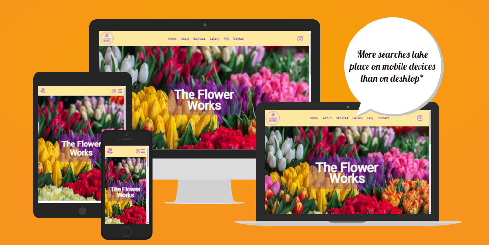
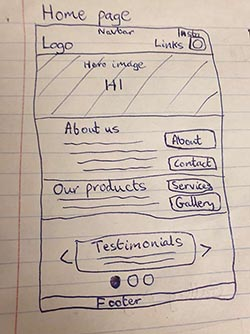
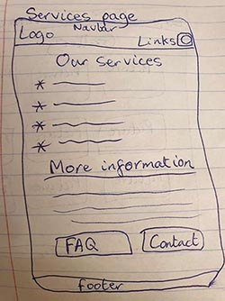
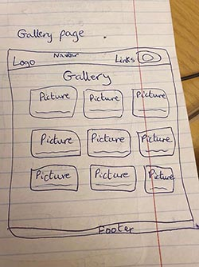
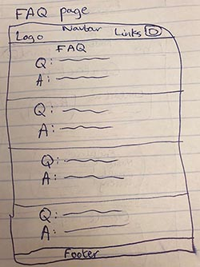

# The Flower Works

Welcome to The Flower Works README file! This has all the essential information about the florist business website.

## Introduction

The Flower Works is a renowned family-run florist specialising in exquisite floral arrangements and services. It is real business located in west London and has an online presence mainly via Instagram.

The business currently has a website; however, it could benefit from enhanced features and a more contemporary design. As a result, I have undertaken a comprehensive revamp, which you can explore [here](https://sasantazayoni.github.io/The-flower-works/).

## User Experience (UX)

### User Stories

* As a user, I want to be able to understand the business brand at a first look.
* As a user, I want to be able to see the prices of products without having to search through various pages.
* As a user, I want to be able to browse through a variety of floral arrangements to see what is available to me.
* As a user, I want to be able to contact someone to ask specific questions and make delivery orders.
* As a user, I want to be able to make enquiries at any time.
* As a user, I want to be able to be able to find the business location.
* As a user, I want to be able to navigate around the website easily.

### Design

Colour scheme:

This combination creates a visually appealing and captivating colour palette that is both vibrant and harmonious.

### Typography

* 'Playfair Display' is the font used for headings with a fallback of the font-stack 'Arial, Helvetica, sans-serif'. Playfair Display is aesthetically pleasing and easily readable. From the multiple suggestions online, this seemed like the most appropriate choice due its vintage appeal.
* 'Roboto' is the font used for the body text with a fallback of the font-stack 'Arial, Helvetica, sans-serif'. Roboto is optimised for web usage and is a popular pairing with Playfair Display. Roboto is also renowned for it versatility, visual appeal and accessibility therefore was a natural choice for the body text.

### Imagery

The images play a vital role in terms of the user experience on a florist website. They are able to captivate visitors and convey the beauty and essence of flowers in a way that words alone cannot. At the time of writing this README.md file, placeholder images are being used but they will be replaced with images supplied by the business owner for the final iteration of the website.

* The logo image is a simple but effective icon that can be reused across many other platforms representing the business brand.
* The hero image is purposely vibrant and beautiful and gives a positive association with the business.
* The image on the about page shows a view of the front of the business.
* The services images show a sample of some of the flowers offered by the business.
* The gallery has been carefully designed with images that are Photoshop-editted so that they are aligned centrally, showing the flowers clearly. This page is extremely important for customers and therefore extra effort has been put into its design so that all images are clear and of high-quality on all screen sizes.
* The modal images are each supplied in a larger size individually to retain the quality of the images.
* The contact page has a placeholder image and works correctly with the grid. This image will be replaced with a picture of the owner of the business.

### Overview

The website is thoughtfully crafted to emanate a vibrant sense of beauty. It seamlessly combines accessibility with small yet impactful features, creating a modern, artistic and elegantly simplistic design.

## Wireframes

All Wireframes were designed for larger screens such as laptops or computers; for medium sized screens such as tablets or large phones; and for small screens down to the smallest phone display.

[Home page](https://imgur.com/gokHG2Y)

About page:

Services page:

Gallery page:

FAQ page:

Contact page:

The wireframes do not fully correspond with the end product due to multiple changes made throughout the production phase.

## Features

### Current features

* All pages are designed using Responsive Design and are fully responsive on all devices.
* The navigation menu collapses on smaller viewports allowing for a more compact view.
* The company logo only displays an icon in smaller viewports for simplicity.
* Navigation bar icons have tooltips for clarity.
* The drop-down menu on the navigation bar has small icons as bullet points that represent the text.
* All anchor links have a visual effect that brightens when hovered over.
* All buttons have a visual effect that brightens the text when hovered over as well as an additional ripple effect for aesthetics.
* All pages have a navigation button in the bottom right corner to be able to navigate to the top of the page which only appears when scrolling down from the navigation bar.
* The testimonials section on the home page features interactive buttons for switching between different testimonials, accompanied by tabs that indicate the corresponding testimonial numbers.
* The gallery page has been carefully engineered to showcase flowers on all viewports with a hover effect that elegantly reveals the name of the flowers.
* When clicking on each flower image on the gallery page, a modal image is triggered, providing an enlarged and detailed view.
* The enquiries form on the contact page is integrated with the backend server, formspree.io. This integration facilitates efficient handling of enquiries, ensuring that they are directly forwarded to the company's designated email address.
* The contact page also features an embedded Google Maps location, providing a visual representation of the company's address for easy reference.

## Future features

* To enhance customer feedback and engagement, an optional reviews section can be integrated as an extension to the contact page, allowing customers to share their valuable reviews and experiences with the business.
* To streamline the ordering process, provide responsive customer support, and gather valuable feedback, the introduction of a chatbot with notifications can enhance the website's functionality. The chatbot will facilitate order placement, address customer inquiries, and enable efficient communication for an enhanced user experience.
* To facilitate communication and provide quick assistance, the addition of a live chat feature allows users to easily connect with the florist. This feature enables direct interaction, allowing customers to inquire about availability, explore delivery options, and seek answers to any other inquiries they may have.

## Technologies used

### Languages

* HTML5
* CSS3
* JavaScript
